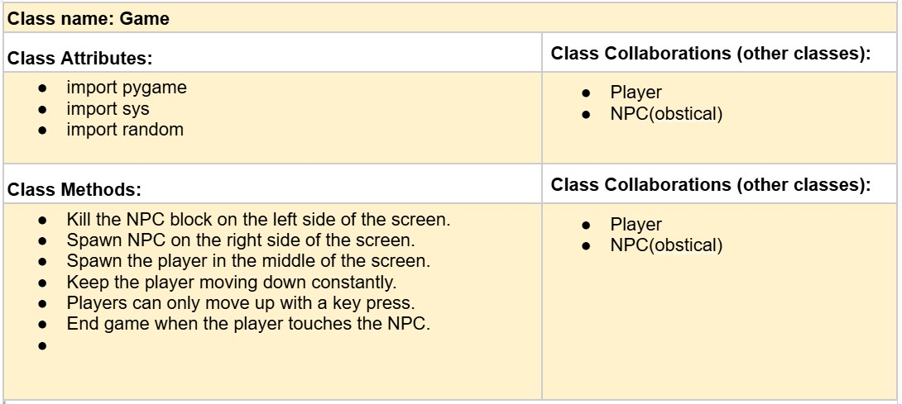

# CSC226 Final Project

## Instructions

️Exclamation Marks ️indicate action items; you should remove these emoji as you complete/update the items which 
  they accompany. (This means that your final README should have no ️in it!)

️**Author(s)**: Wyatt McQueen, Bernave Santos

**Google Doc Link**: https://docs.google.com/document/d/1gJKO-ahV0Np3GpD2MhwgrgFBDdF-2dxPcMNFvqcvGx8/edit?usp=sharing

---

## Milestone 1: Setup, Planning, Design

**Title**: `Wing Dash`

**Purpose**: `Fly through pillers without getting hit.`

**Source Assignment(s)**: `T12-T8 & HW 10-9.`

**CRC Card(s)**:
  - Create a CRC card for each class that your project will implement.
  - See this link for a sample CRC card and a template to use for your own cards (you will have to make a copy to edit):
    [CRC Card Example](https://docs.google.com/document/d/1JE_3Qmytk_JGztRqkPXWACJwciPH61VCx3idIlBCVFY/edit?usp=sharing)
  - Tables in markdown are not easy, so we suggest saving your CRC card as an image and including the image(s) in the 
    README. You can do this by saving an image in the repository and linking to it. See the sample CRC card below - 
    and REPLACE it with your own:
  
(image/"Image of CRC card as an example. Upload your CRC card(s) in place of this one. ")

**Branches**: This project will **require** effective use of git. 

Each partner should create a branch at the beginning of the project, and stay on this branch (or branches of their 
branch) as they work. When you need to bring each others branches together, do so by merging each other's branches 
into your own, following the process we've discussed in previous assignments, then re-branching out from the merged code.  

```
    Branch 1 starting name: Wyatt
    Branch 2 starting name: Santosb2
```

### References 

Throughout this project, you will likely use outside resources. Reference all ideas which are not your own, 
and describe how you integrated the ideas or code into your program. This includes online sources, people who have 
helped you, AI tools you've used, and any other resources that are not solely your own contribution. Update this 
section as you go. DO NOT forget about it!

Chat Gpt, T12-T8 & HW 10-9, https://www.w3resource.com/python-exercises/tkinter/python-tkinter-canvas-and-graphics-exercise-10.php?utm,
https://www.pygame.org/docs/ ,https://www.pygame.org/wiki/tutorials, https://www.geeksforgeeks.org/python/introduction-to-pygame/ , 
https://inventwithpython.com/pygame/ , https://github.com/sourabhv/FlapPyBird?utm_source , 
---

## Milestone 2: Code Setup and Issue Queue

❗Most importantly, keep your issue queue up to date, and focus on your code. 🙃

❗Reflect on what you’ve done so far. How’s it going? Are you feeling behind/ahead? What are you worried about? 
What has surprised you so far? Describe your general feelings. Be honest with yourself; this section is for you, not me.

```
What we have done so far is start on the code and then found a way to do it better and easyer. So we doing it that way because it makes
it easyer to read and keep track of where we are. We are feeling a little behind and ahead at the same time.
We are worried about getting it all funtunal and easy to read and talk about. The thing that has surprised us so far
is how we are using a lot of what we did and used in class. Our general feelings on this section for us not me is ok but there
is a lot of stress as this is our final project..
```

---

## Milestone 3: Virtual Check-In

Indicate what percentage of the project you have left to complete and how confident you feel. 

**Completion Percentage**: `67%`

️**Confidence**: Describe how confident you feel about completing this project, and why. Then, describe some 
  strategies you can employ to increase the likelihood that you'll be successful in completing this project 
  before the deadline.

```
  We feel good about completing this project. We are keeping it simple while useing what we lurned in clss. 
  Some strategies we can employ to increase the likelihood that we'll be successful in 
  completing this project before the deadline is getting a good set work scedual so we can get 
  it done in a more ordaly manner.

---

## Milestone 4: Final Code, Presentation, Demo

        This program creates a simple Flappy-Bird–style game using the Python library pygame. It starts
    by setting up a 400×600 game window with a light-blue background and loads a small bird image 
    that the player controls. The bird has gravity pulling it downward & a jump force that 
    pushes it upward whenever the player presses the space bar. Each frame, 
    the bird’s velocity changes because of gravity, causing it to fall unless it jumps. 
    The game also generates a top or bottom pipes at random; one pipe is upright and the other is 
    flipped upside-down to form a gap the bird must fly through. These pipes move from right to left across 
    the screen. Inside the main game loop, the program handles key presses, updates the bird’s movement, 
    spawns new pipes, draws the graphics, & updates the display 60 times per second. When the loop starts, 
    the game runs continuously until the window is closed or the player toutches a pipe.

### Errors and Constraints

Every program has bugs or features that had to be scrapped for time. These bugs should be tracked in the issue queue. 
You should already have a few items in here from the prior weeks. Create a new issue for any undocumented errors and 
deficiencies that remain in your code. Bugs found that aren't acknowledged in the queue will be penalized.

### Reflection

Each partner should write three to four well-written paragraphs address the following (at a minimum):
- Why did you select the project that you did?
- How closely did your final project reflect your initial design?
- What did you learn from this process?
- What was the hardest part of the final project?
- What would you do differently next time, knowing what you know now?
- How well did you work with your partner? What made it go well? What made it challenging?

```
    Partner 1: We picked this project because we both liked Flappy Bird and we wanted to try making something that actually moved on the screen instead of just printing text in the console. 
At first it seemed pretty simple, like “just make the bird jump,” but once we started adding gravity and images it got a little more tricky. 
Still, it felt fun to make something that looks sort of like a real game and not just code. 
We also liked the idea of learning how sprites and classes worked in Pygame since we didn’t really understand them at first.

Our final project is kinda close to what we thought in the beginning, but not exactly. 
We planned to have working pipes, scoring, and maybe sounds, but we didn’t have enough time to finish all of that. 
The bird movement and the jumping mechanic match our original idea though, so that part turned out good. 
A lot of our first design was more like “wishfull thinking,” and when we actually started coding we relized some things where harder then we expected.
Still, the general feel of a Flappy Bird style game is pretty much there.

The hardest part was getting the pipes to spawn right and flip correctly. 
We kept messing up the rectangle positions and the flipping code, and sometimes the pipes would appear halfway off the screen or just not show up at all. 
Another thing that was kinda confusing was figuring out how gravity, jump force, and velocity should work together so the bird didn’t fly too fast or fall like a rock.
We definatly learned a lot about troubleshooting and testing things little by little instead of trying to fix everything at once.

If we did this again, we would probaly start with a more organized plan and get collision detection working earlier. 
We also would test smaller pieces of the game instead of adding a bunch of code and hoping it worked the first try. 
Working with my partner went pretty well overall because we both understood different parts of the project and helped each other out.
```

```
    Partner 2: I chose this project because I grew up playing Flappy Bird and thought it would be fun and easy to make 
    my own version. My final project stayed close to my first design because I kept the same ideas for the classes and 
    functions, even though I had to restart. I learned a lot about how classes work, how to look for the right 
    resources, and the difference between tkinter and pygame. The hardest part was figuring out how everything worked 
    and having to look through many sources just to understand small things. If I could do this again, I would spend 
    more time learning the tools first so I would not have to restart so much. Working with my partner was both good 
    and hard because I understood his situation, but it still put a lot on me during finals, even though he is helping 
    more now and that makes things easier. 
```

---